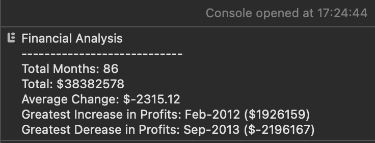

# Console Finances Challenge

## Description

I was given the task of writing JavaScript code for analysing the financial records of a company

Statistics to be calculated:
- The total number of months included in the dataset.
- The net total amount of Profit/Losses over the entire period.
- The average of the changes in Profit/Losses over the entire period.
- The greatest increase in profits (date and amount) over the entire period.
- The greatest decrease in losses (date and amount) over the entire period.

The application will be completed when all of the above satistics are output to the console with accompanying descriptive text.

## Table of contents
- [Installation](#installation)
- [Usage](#usage)
- [Credits](#credits)
- [License](#license)

## Installation
N/A

## Usage
- [Deployed Application](https://trunten.github.io/ubbc-console-finances/)
- JavaScript is required for the site to function (make sure it is enabled).
    - noscript tag included to alert the user that JavaScript is required.
- Open the developer tools and view the console to see the application.
- Preview of the output:

- Statistics are also viewable in the browser just for a little fun.

## Credits
- Wrapping text in \<pre\> elements: https://www.w3docs.com/snippets/css/how-to-wrap-text-in-a-pre-tag-with-css.html
- ASCII art headers: http://www.figlet.org

## License
Please refer to the [LICENSE (MIT)](LICENSE) in the repo.